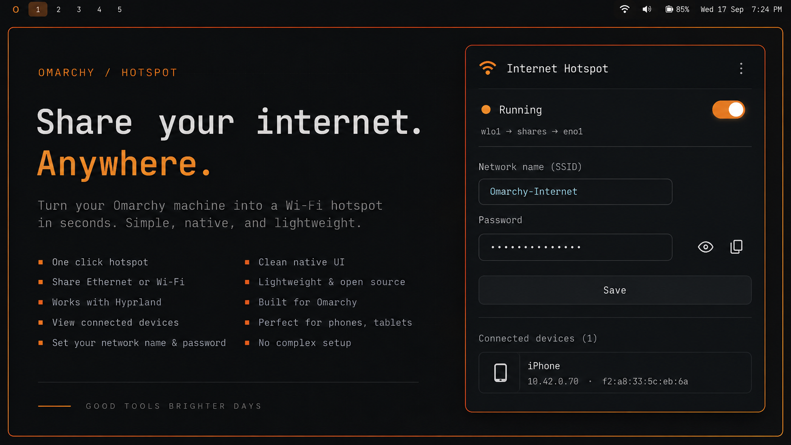

# Internet Hotspot — Omarchy plugin



Turns your laptop into a Wi-Fi hotspot that shares its Ethernet internet
connection, from a bar widget. No terminal needed after install.

## Requirements

- Omarchy 4.0+ (Quickshell-based shell plugin system)
- NetworkManager with a Wi-Fi adapter that supports AP mode (most laptops)
- UFW as the active firewall (Omarchy's default)
- `dnsmasq` — NetworkManager's own optional dependency for Wi-Fi hotspot
  sharing; `install.sh` offers to install it via `pacman` if missing
- `polkit` (already part of Omarchy) — used for the GUI's auth prompt

## Install

1. Clone this repo into `~/.config/omarchy/plugins/`:
   ```bash
   omarchy plugin add https://github.com/imargorsi/omarchy-hotspot.git
   ```
2. **Required one-time setup** — the widget cannot start/stop the hotspot
   until this runs; it installs the backend CLI to `/usr/local/bin/` and a
   polkit policy so the GUI can prompt for auth like a normal desktop app
   instead of needing a terminal. The helper runs as root, so read
   `bin/share-internet` and `install.sh` first. `install.sh` lists what it
   will install, and asks before installing `dnsmasq`:
   ```bash
   ~/.config/omarchy/plugins/io.github.imargorsi.hotspot/install.sh
   ```
3. Add the widget to your bar (`omarchy bar put io.github.imargorsi.hotspot`,
   or edit `~/.config/omarchy/shell.json` — see Omarchy's plugin docs), then
   reload plugins: `omarchy-shell shell rescanPlugins`.

## Uninstall

1. Stop the hotspot and remove everything `install.sh` set up (the helper,
   the polkit policy, `/etc/share-internet`, the saved NetworkManager
   profile). It leaves the plugin folder and `dnsmasq` alone:
   ```bash
   ~/.config/omarchy/plugins/io.github.imargorsi.hotspot/uninstall.sh
   ```
2. Remove the plugin itself (this also removes its bar widget):
   ```bash
   omarchy plugin remove io.github.imargorsi.hotspot
   ```
3. Optional: `sudo pacman -R dnsmasq` if you installed it only for this.

## What it changes on your system

Only while the hotspot is running (all of it is undone by **stop**):

- A NetworkManager connection named `Omarchy-Hotspot` (AP mode, WPA2) on
  your Wi-Fi interface. Your previous Wi-Fi connection is reconnected on stop.
- UFW rules: forward Wi-Fi → Ethernet, and allow DHCP/DNS (UDP 67, UDP/TCP
  53) in on the Wi-Fi interface. Stop deletes these same rules, so an
  identical rule you added yourself beforehand would be removed too.
- A separate `nft` NAT table `share_internet_nat` (masquerade on Ethernet).
- `net.ipv4.ip_forward=1`, restored to its previous value on stop.
- Wi-Fi is unblocked with `rfkill` if it was soft-blocked.

Persistent files: `/usr/local/bin/share-internet`,
`/usr/share/polkit-1/actions/io.github.imargorsi.hotspot.policy`,
`/etc/share-internet/` (SSID/password/state, root-only), and the
NetworkManager profile. Nothing in your own configuration
(`~/.config`, `shell.json`, UFW's defaults) is edited by the plugin.

## Using it

- Click the Wi-Fi icon in the bar to open the panel.
- Toggle switch starts/stops the hotspot. First click of a session prompts
  for your password (a normal polkit dialog); further clicks for a while
  are not re-prompted (cached).
- Edit the SSID/password fields and hit **Save** — applies immediately if
  the hotspot is already running.
- Connected devices (hostname/IP/MAC) show live while the panel is open.

## How it works / architecture

- `bin/share-internet` — the actual logic (bash): detects your Ethernet +
  Wi-Fi interfaces, configures a NetworkManager AP (`ipv4.method=shared`),
  opens the minimum UFW firewall rules needed (forwarding + DHCP/DNS input),
  and manages its own NAT table. Installed to `/usr/local/bin/share-internet`
  by `install.sh`. Also fully usable directly from a terminal:
  `share-internet [start|stop|restart|status|credentials|configure <ssid>]`
  (`configure` reads the new password from stdin, e.g.
  `echo 'new password' | share-internet configure MyNetwork`, or prompts
  for it on a terminal).
- `io.github.imargorsi.hotspot.policy` — a polkit policy naming that exact
  script, installed to `/usr/share/polkit-1/actions/`. This is what lets the
  bar widget call `pkexec /usr/local/bin/share-internet ...` and get a
  proper graphical auth prompt (via omarchy-shell's own polkit agent)
  instead of failing the way a plain `sudo` would from a GUI context.
- The backend writes a **world-readable** status snapshot to
  `/run/share-internet-status.json` on every start/stop/status call
  (SSID, running state, connected clients — **never the password**).
  `Service.qml` watches that file, so the bar/panel update live. The
  password is fetched separately, only while the panel is open, via
  `pkexec share-internet credentials` (returned on the pipe's stdout, kept
  in memory only). Only actions that change something
  (start/stop/configure) go through `pkexec` otherwise.
- `Service.qml` / `BarWidget.qml` / `Panel.qml` — the QML side: bar icon,
  popup panel, editable SSID/password, connected-devices list.

## Making changes

- **UI tweaks**: edit `BarWidget.qml` / `Panel.qml` directly; Quickshell
  hot-reloads on save (see Omarchy's plugin docs — save anywhere under
  `~/.config/omarchy/plugins/` reloads automatically).
- **Backend/firewall logic**: edit `bin/share-internet`, then re-run
  `install.sh` to push the updated copy to `/usr/local/bin/`.
- **Uninstall everything this plugin set up**: `./uninstall.sh`.

## Security notes

This is designed for a personal, single-user laptop, not a shared/multi-user
machine. Trade-offs made deliberately for a simple, no-daemon design:

- The Wi-Fi password is never written to `/run/share-internet-status.json`
  (world-readable, 0644) and never passed as a command-line argument.
  A new password is sent to the privileged helper on **stdin**, and the
  helper puts it into the NetworkManager profile through a root-only
  (0600) keyfile rather than `nmcli ... wifi-sec.psk <password>`, so it is
  never visible in `ps` or `/proc/<pid>/cmdline`. The panel's **Copy**
  button pipes the password to `wl-copy` on stdin for the same reason.
- `/etc/share-internet/config` (the persisted SSID/password) and the
  `/etc/NetworkManager/system-connections/Omarchy-Hotspot.nmconnection`
  profile are root-only (0600).
- The status snapshot still lists connected clients (hostname/IP/MAC) to
  every local user.

If you're adapting this for a shared machine, don't — or at least tighten
these before you do.

### Implementation notes

- UFW forwarding rules must go through the real `ufw` CLI
  (`ufw route allow ...` + `ufw reload`) — hand-editing
  `/etc/ufw/user.rules` does not reliably apply live.
- NetworkManager's internal `dnsmasq` (used for `ipv4.method=shared`) binds
  normal UDP sockets for DHCP (67) and DNS (53) — not raw sockets — so
  UFW's default `deny (incoming)` silently blocks them unless you add
  explicit `ufw allow in on <wifi> to any port 67/53 ...` rules. Symptom if
  you skip this: client associates fine, gets a `169.254.x.x` APIPA address
  instead of a real DHCP lease, and reports "no internet."
- `dnsmasq` itself must be installed (`pacman -Qi networkmanager` lists it
  as an optional dep for connection sharing) — without it NM hotspot
  activation fails with "IP configuration could not be reserved."

## License

MIT
